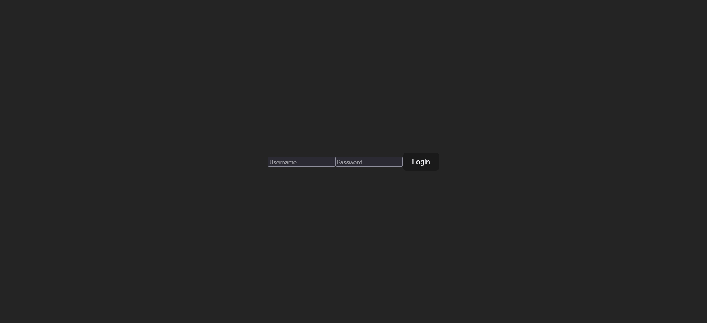

# Full Stack Login System

# Overview

Made by:

- **React**
- **React Router**
- TypeScript
- Node.js
- MongoDb

## Server side packages

- Express
- Cors
- nodemon (--save-dev)
- dotenv (--save-dev)
- mongoose

## Description

- `npm i` for setup server and client first.
- Dashboard can be reached after succesfully logging in.
- Setup your .env file according to `.env-sample` with your MongoDb URI.
- `/login`, `/setup` and `/dashboard` routes are active.

- run `npm start` for server and run `npm run dev` for client to start app.

### Author

- LinkedIn - [Ömer Fatih Bülbül](https://www.linkedin.com/in/ömer-fatih-bülbül-74a890236/)
- Twitter - [fatihbulbul91](https://twitter.com/fatihbulbul91)
